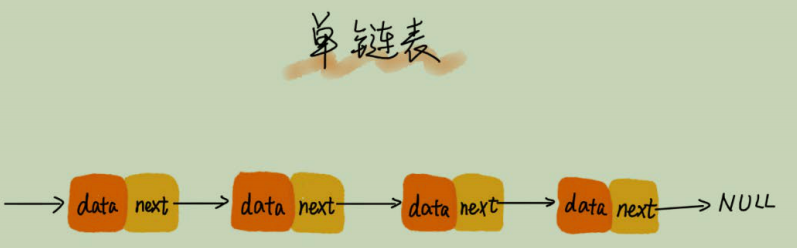

# 链表（上）：如何实现LRU缓存淘汰算法？

链表的经典应用场景：LRU缓存淘汰算法
三种常见策略：
- 先进先出策略FIFO(First In First Out)
- 最少使用策略LFU(Least Frequently Used)
- 最近最少使用LRU(Least Recently Used)

## 链表结构

1. 单链表   
    每个链表的节点除了存储数据之外，还需要记录链上下一个节点的地址，我们称记录下一个节点地址的指针叫后继指针`next`  
   
    
    第一个节点叫作`头结点`,最后一个结点叫作`尾结点`。头结点用来记录链表的基地址，可以用来遍历得到整个链表。尾结点的指针不是指向下一个
   节点，而是指向一个空地址`NULL`，表示这是链表上最后一个结点。
   
    