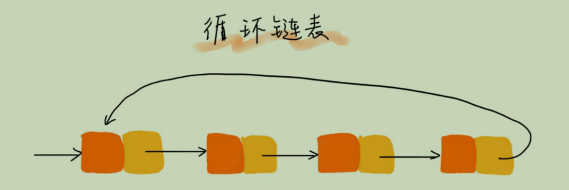

# 链表（上）：如何实现LRU缓存淘汰算法？

链表的经典应用场景：LRU缓存淘汰算法
三种常见策略：
- 先进先出策略FIFO(First In First Out)
- 最少使用策略LFU(Least Frequently Used)
- 最近最少使用LRU(Least Recently Used)

## 链表结构

1. 单链表   
    每个链表的节点除了存储数据之外，还需要记录链上下一个节点的地址，我们称记录下一个节点地址的指针叫后继指针`next`。  
   
      
   
    第一个节点叫作`头结点`,最后一个结点叫作`尾结点`。头结点用来记录链表的基地址，可以用来遍历得到整个链表。尾结点的指针不是指向下一个
   节点，而是指向一个空地址`NULL`，表示这是链表上最后一个结点。  
   
    在链表中插入和删除一个数据是非常快速的，所对应的时间复杂度是O(1)  

      
    ```
    插入结点b：  
   x.next = b.next
   b.next = x
   删除结点b:
   a.next = b.next
    ```  
   链表想随机访问第 K 个结点，没有数组那么高效，需要根据结点去遍历，直到找到相应的节点。故链表的随机访问的性能没有数组好，
   时间复杂度`O(n)`
   
2. 循环链表  
    循环链表的尾结点指针是指向链表的头结点的。
   
     

   循环链表的优点就是链尾到链头比较方便。

3. 双向链表  
   每个结点支持两个方向：后继指针`next`指向后面的结点和前驱指针`prev`指向前面的结点。  
     
     

   双向链表需要额外的两个空间来存储后继结点和前驱结点的地址，比单链表占用更多的空间，但是更加灵活。  
   从结构上看，双向链表可以支持`o(1)`时间复杂度的情况下找到前驱结点，在某些情况下，插入和删除等操作要比单链表简单、高效。  
   
   - 删除操作  
   在链表中，删除无外乎两种情况：
     - 删除结点中"值等于某个给定值"的结点
     - 删除给定指针指向的结点
   
   对于第一种情况：不管是单链表还是双向链表，为了查找某值等于给定值得结点，都需要从头结点开始遍历，直到找到为止，总时间复杂度`O(n)`  
   对于第二种情况：已经知道要删除的结点，需要知道删除结点的前驱结点，单链表不能直接获取，双向链表可以直接获取
   
   - 插入操作  
   同理分析插入，插入结点前后  
     
   需要掌握的设计思想：空间换时间。当内存充足的时候，如果我们更加追求代码的执行速度，可以选择空间复杂度相对高，但时间复杂度相对低的
算法或者数据结构
   
## 链表 vs 数组性能大比拼

     
   
   数组和链表的对比，并不能仅仅局限于时间复杂度。  
   数组实现是连续的内存空间，可以借助CPU的缓存机制，预读数组中的数据，所以访问效率高。而链表在内存中并不是连续存储的，所以对缓存不友好
   没办法预读。
   数组的缺点是大小固定，声明过大，系统可能没有足够的连续空间给它；声明过小，出现不够用，这时在申请更大的空间，需要拷贝数据，非常费时。
   链表没有大小的限制，天然支持动态扩容，这是和数组的最大区别吧。
   
## 如何基于链表实现LRU缓存淘汰算法？
   思路：我们维护一个有序单链表，越靠近链表尾部的结点是越早之前访问的。当一个新的数据被访问时，我们从链表头开始顺序遍历链表。  
   1. 如果此时数据之前已经被缓存在链表中了，我们遍历得到数据对应的结点，并将其从原来的位置删除，然后再插入到链表的头部。  
   2. 如果此数据没有在缓存链表中，又可以分为两种情况：
   - 如果此时缓存未满，则将此结点直接插入到链表的头部；
   - 如果此时缓存已满，则链表尾结点删除，将新的数据结点插入链表的头部。  
   这种基于链表的实现思路，缓存访问的时间复杂度为`O(n)`，在之后引入散列表，缓存访问的时间复杂度降到`O(1)`。
     
## 内容小结

   和数组相比，链表更适合插入，删除操作频繁的场景，查询的时间复杂度较高。

## 课后思考
   如何判断一个字符串是否是回文字符串的问题，如果字符串是通过单链表来存储的，那该如何判断是一个回文呢？此时空间复杂度是多少？