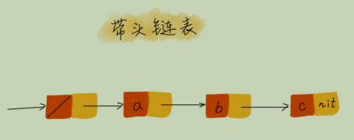

# 07|链表（下）：如何轻松写出正确的链表代码？

## 技巧一：理解指针或引用的含义

对于指针的理解：  
将某个变量赋值给指针，实际上就是将这个变量的地址赋值给指针，或者反过来说，指针中存储了这个变量的内存地址，指向了这个变量，
通过指针就能找到这个变量。
`p -> next = q` 代码解释，p 结点中的 `next` 指针存储了 q 结点的内存地址
`p -> next = p -> next ->next` 解释：p 结点的`next`指针存储了 p 结点的下下一个结点的内存地址

## 技巧二：警惕指针丢失和内存泄漏

## 技巧三：利用哨兵简化实现难度

1. 插入结点
    第一结点插入和其他结点插入逻辑不一样
    ```
    if (head == null) {
        head = newNode
   }
   ```
2. 删除结点
    删除链表最后一个结点
   ```
    if (head->next == null)
    head = null
    ```
在针对链表的插入、删除操作，需要对插入第一个结点和删除最后一个结点的情况进行特殊处理。这样代码实现起来就会很繁琐，不简洁，容易出错。

利用哨兵解决边界问题，不直接参与业务逻辑。head = null 表示链表中没有结点了。其中head 表示头结点指针，指向链表中的第一个结点，
如果我们引入哨兵结点，在任何时候，不管链表是不是空，head 指针都会一直指向这个哨兵结点。我们称这种有哨兵结点的链表为带头链表。



## 技巧四：重点留意边界条件处理  


 检查边界条件是否正确：
- 如果链表为空时，代码是否正常工作
- 如果链表只包含一个结点，代码是否能正常工作
- 如果链表只包含两个结点时，代码能否正常工作
- 代码逻辑在处理头结点和尾结点的时候，是否能正常工作

## 技巧五：举例画图，辅助思考
    
## 技巧六：多写多练，没有捷径

5个常见的链表操作：
    - 单链表反转
    - 链表中环的检测
    - 两个有序的链表的合并
    - 删除链表中倒数第n个结点
    - 求链表的中间结点

