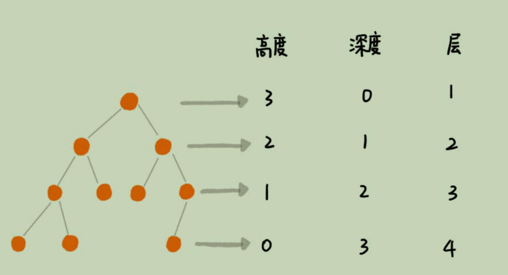
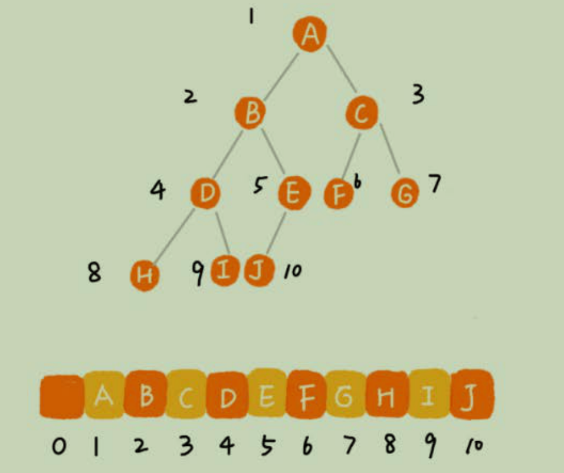
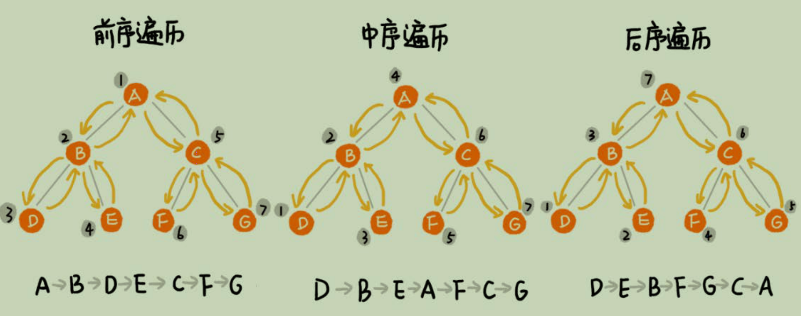

# 二叉树基础（上）：什么样的二叉树适合用数组来存储？

## 树
1. 节点的高度 = 节点到叶子节点的最长路径（边数）
2. 节点的深度 = 根节点到这个节点所经历的边的个数
3. 节点的层数 = 节点的深度 + 1
4. 树的高度  = 根节点的高度

## 二叉树

每个节点最多有两个"叉"，也就是两个子节点，分别是左子节点和右子节点。
1. 满二叉树：叶子节点全都在最底层，除了叶子节点外，每个节点都有两个子节点
2. 完全二叉树：叶子节点都在最底下两层，最后一层的叶子节点都靠左排列，并且除了最后一层，其它层的节点
个数都要达到最大

### 如何表示（或存储）一颗二叉树？

1. 基于指针或者引用的二叉链式存储法
2. 基于数组的顺序存储法

根节点存储在下标i=1的位置，那么左子节点存储在下标 `2*i = 2`的位置上，右子节点存储在
`i*2 + 1 = 3`的位置上依次类推。
如果节点`X`存储在数组中下标为`i`的位置，下标为`2*i`的位置存储的就是左子节点，下标为
`i*2+1`的位置存储的就是右子节点，它的父节点的位置就是`i/2`。通过这种方式，直到根节点
，所有的树都可穿起来。如果不是一颗完全二叉树，会浪费比较多的数组空间。如果是一颗完全二叉树，
那么用数组存储是最节省内存的一种方式。这就是要求最后一层的子节点要靠左的原因。

#### 应用

堆和堆排序

## 二叉树的遍历

1. 经典的方法有三种
    - 前序遍历
    - 中序遍历
    - 后续遍历
    > 前中后序表示的是节点与他们左右子树节点遍历打印的先后顺序。
                                               

前中后序遍历就是一个递归过程，遍历的复杂度每个节点最多被访问两次，所以时间复杂度O(n)

2. 层序遍历，如何实现？
借住队列来实现，如果该节点的子节点不为空，就将左右子节点放进去，广度优先（BFS）